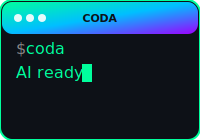

<div align="center">
  
  
  # Coda - Code Assistant
  
  A powerful, multi-provider AI code assistant that brings the best of AI-powered development directly to your terminal.
</div>

---

[](https://opensource.org/licenses/MIT)
[](https://www.python.org/downloads/)
[](https://github.com/psf/black)

## ✨ What is Coda?

Coda is your AI pair programmer that lives in your terminal, supporting multiple AI providers including Oracle OCI GenAI, OpenAI, Anthropic, Google, and 100+ more via LiteLLM.

## 🚀 Quick Start

```bash
# Clone the repository
git clone https://github.com/djvolz/coda-code-assistant.git
cd coda-code-assistant

# Install with uv (recommended)
uv sync

# Run Coda
uv run coda
```

## 📖 Documentation

For comprehensive documentation, visit our **[Wiki](https://github.com/djvolz/coda-code-assistant/wiki)**:

- **[Getting Started Guide](https://github.com/djvolz/coda-code-assistant/wiki/Getting-Started)** - Installation and setup
- **[AI Modes](https://github.com/djvolz/coda-code-assistant/wiki/AI-Modes)** - Specialized AI personalities
- **[Development Guide](https://github.com/djvolz/coda-code-assistant/wiki/Development-Guide)** - Contributing and development workflow
- **[Troubleshooting](https://github.com/djvolz/coda-code-assistant/wiki/Troubleshooting)** - Common issues and solutions

## 🎯 Key Features

- 🌐 **Multi-Provider Support**: Works with Oracle OCI GenAI, Ollama, OpenAI, Anthropic, Google, and 100+ providers
- 💻 **Terminal-First**: Designed for developers who live in the command line
- 🧠 **Smart AI Modes**: Specialized modes for coding, debugging, explaining, and reviewing
- 💾 **Session Management**: Save, resume, and branch conversations
- 🎨 **Beautiful Interface**: Rich terminal UI with syntax highlighting
- 🔧 **Tool Integration**: File operations, web search, and more via MCP

## 🤝 Contributing

We welcome contributions! Please see our [Contributing Guide](CONTRIBUTING.md) for details.

## 📄 License

This project is licensed under the MIT License - see the [LICENSE](LICENSE) file for details.

## 🔗 Links

- [Full Documentation](https://github.com/djvolz/coda-code-assistant/wiki)
- [Issue Tracker](https://github.com/djvolz/coda-code-assistant/issues)
- [Discussions](https://github.com/djvolz/coda-code-assistant/discussions)
- [Roadmap](https://github.com/djvolz/coda-code-assistant/blob/main/ROADMAP.md)

---

<p align="center">Made with ❤️ by the Coda community</p>